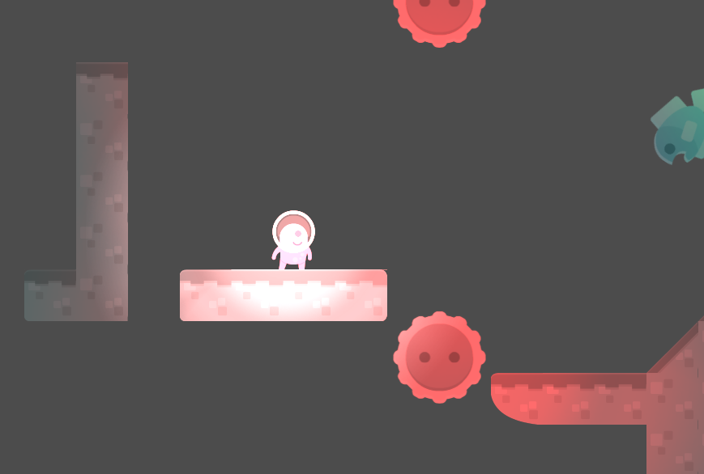
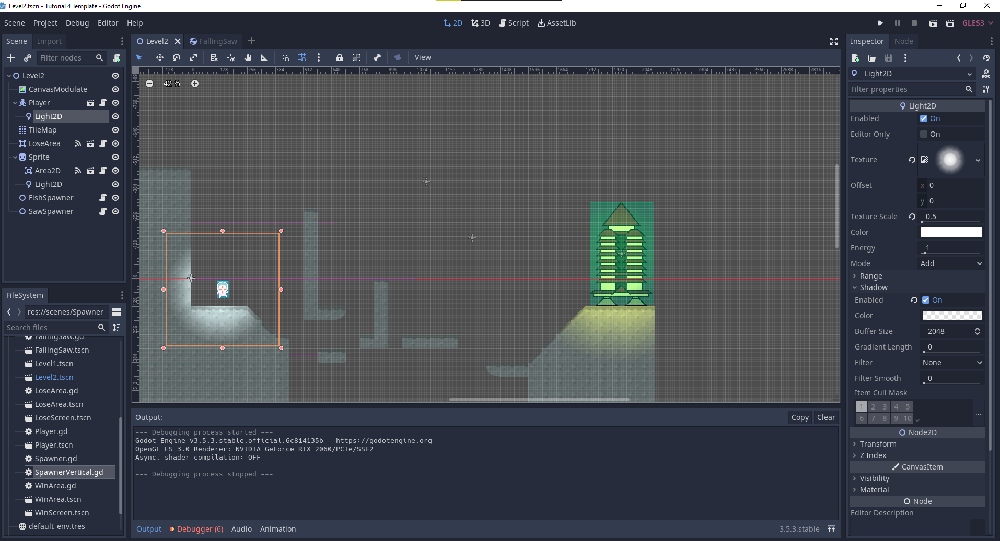

# Tutorial 3 Game Development CSUI Even Semester 2023/2024
Created by Stefanus Ndaru Wedhatama - 2006526812

## Excercise
### New Features
#### Double Jump
Double jump di tutorial ini dilakukan di pecahan kode berikut
```gd
var double_jump = false

func get_input():
	if is_on_floor():
		double_jump = true
	if is_on_floor() and Input.is_action_just_pressed('ui_up'):
		velocity.y = jump_speed
	if !is_on_floor() and Input.is_action_just_pressed('ui_up') and double_jump:
		velocity.y = jump_speed
		double_jump = false
```
Implementasi double jump menggunakan mekanik dari `boolean` untuk menentukan apakah karakter _eligible_ untuk double jump. Ketika karakter menyentuh tanah, maka status double jump akan menyala. Lalu, jika tidak berada di tanah, alias ketika karakter sedang jatuh atau sedang melompat, maka karakter dapat melompat lagi, menghasilkan double jump. Implementasi ini juga kebetulan memberikan kemampuan bagi karakter untuk air jump, alias lompat di udara sebanyak satu kali.

> Fungsi ini diadaptasi dan digunakan kembali dari Tutorial 3

#### New Spawner
Ada spawner dan musuh baru berupa Falling Saw, yang merupakan gergaji jatuh dan memiliki mekanisme sama seperti Falling Fish, di mana player akan kalah jika menyentuhnya.



Bedanya dengan Falling Fish, Falling Saw hanya akan jatuh di satu titik, yaitu di lompatan terakhir sebelum titik akhir, dengan memodifikasi kode Falling Fish sehingga hanya akan spawn di titik X tertentu dan memiliki interval lebih tinggi.

```godot
func spawn():
	var spawned = obstacle.instance()
	get_parent().add_child(spawned)

	var spawn_pos = global_position
	spawn_pos.x = spawn_pos.x

	spawned.global_position = spawn_pos

func repeat():
	spawn()
	yield(get_tree().create_timer(2), "timeout")
	repeat()
```
Pengaturan tersebut dilakukan di Spawner untuk Saw, yaitu `SawSpawner`.


#### Lighting
Adanya Lighting yang membuat Scene menjadi lebih hidup, dengan memanfaatkan `CanvasModulate` untuk set seberapa terang scenenya, dan `Light2D` untuk memancarkan cahaya.



